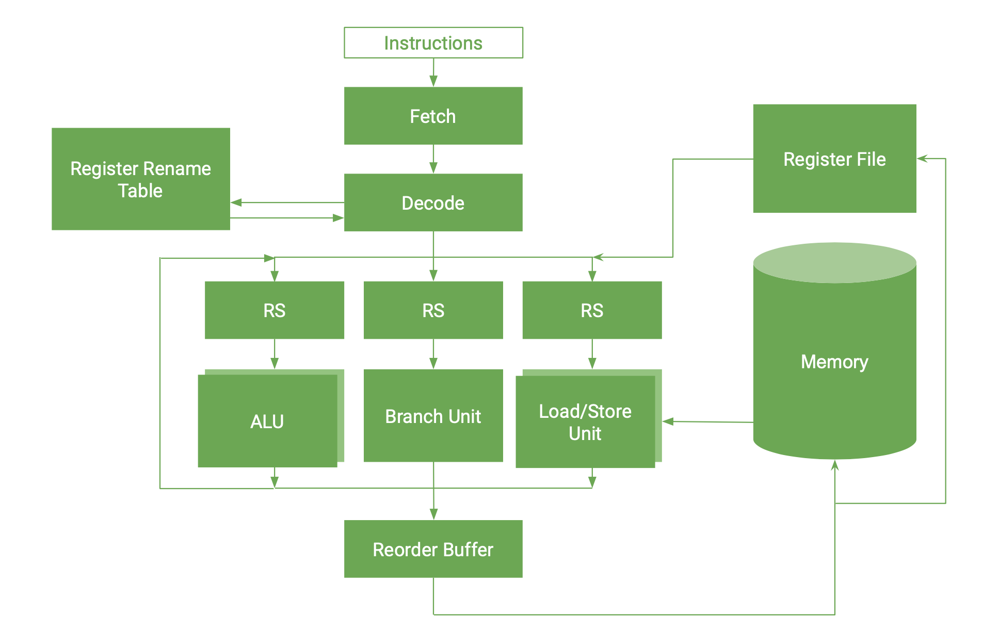

# Processor
Simulator of a pipelined, superscalar processor. 

# Install 

Clone the repo, and then run the following commands. The compiled output can be found in `dist/build/vm`.

```
> cd processor_sim
> cabal sandbox init
> cabal install
> cabal build
```

# Running
The processor runs binary files representing assembly instructions (see *Assembly*). To avoid having to write this manually, the C-- compiler is available [here](https://github.com/BakerSmithA/c--compiler). To run a compiled binary file, simply supply the filename as an argument to this simulator.

# Assembly Instructions

# Design
To run the processor, the following stages of the pipeline are run:

1. **Fetch**; *N* instructions (where *N* is the width of the pipeline) are fetched from the instruction cache.
2. **Decode**; instructions are decoded, and destination registers are renamed to remove false dependencies between instructions.
3. **Execute**; instructions are placed in reservation stations, and then run by their corresponding execution unit once all the instructions dependencies have been resolved.
4. **Commit**; instructions are placed in the reorder buffer. This allows instructions to be written back to memory or registers in the same order as they were fetched. This also allows speculatively executed instructions to be discarded.
5. **Writeback**; instructions are written back to memory or registers.


